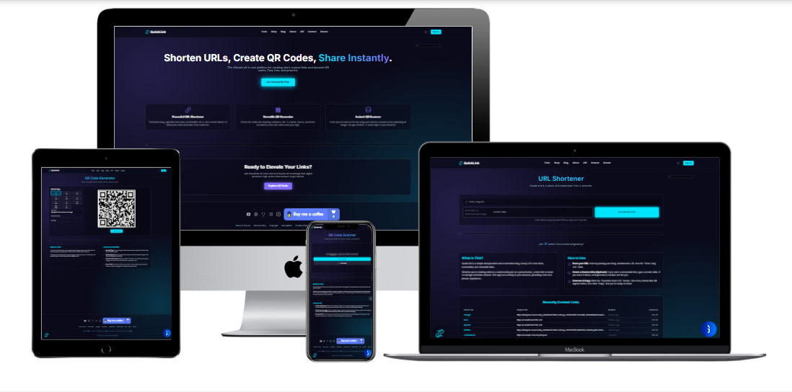
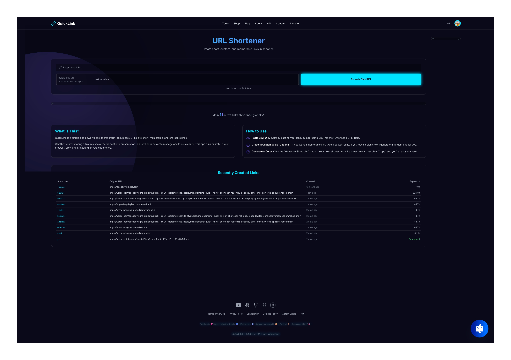
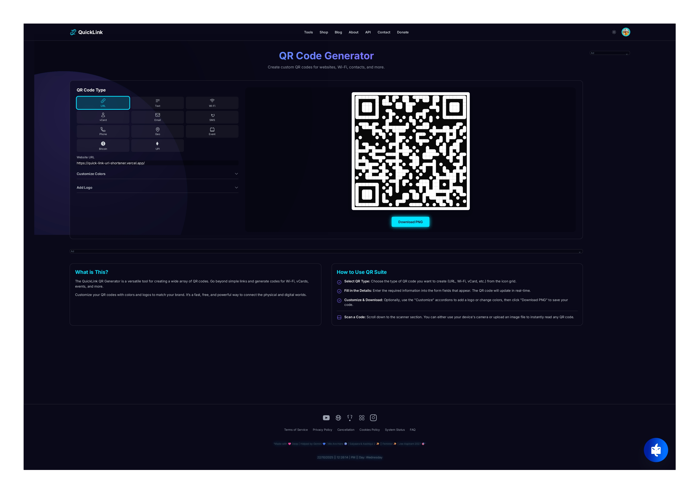
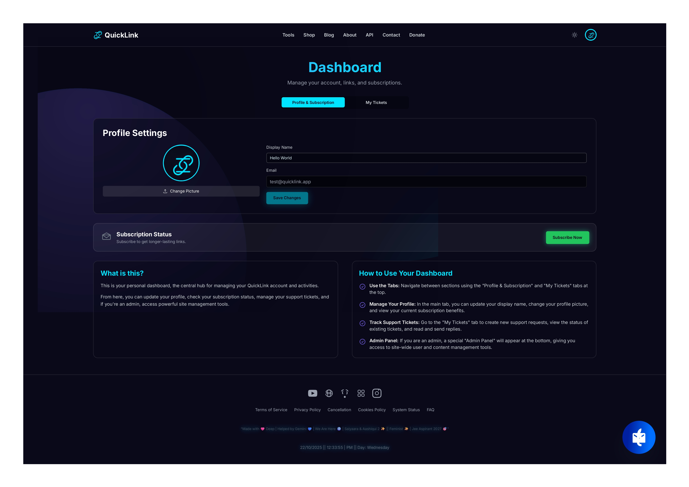
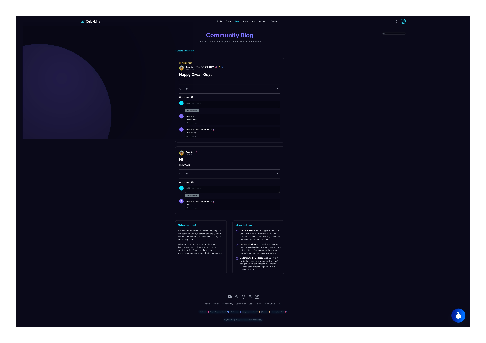

<div align="center">
  
  <h1>QuickLink - URL Shortener, QR Suite, & Community Blog</h1>
  <p>
    <strong>A modern, high-performance, full-stack web application that provides a suite of powerful tools for the modern web.</strong>
  </p>
  <p>
    
    
    
    
    
    
    </img>
  </p>
</div>
<p align="center">
  
</p>


**QuickLink** is a feature-complete, stable, and production-ready platform designed to make sharing information as seamless, secure, and efficient as possible. It provides a fast, reliable, and feature-rich suite to shorten URLs, generate dynamic QR codes, and engage with a community for everyone—from individuals sharing content with friends, to businesses engaging with customers on a global scale.

**[➡️ Live Demo](https://quick-link-url-shortener.vercel.app/)**

---

**[🩷 Support](https://www.chatbase.co/z1dBVS3yYaFm-L9FJnbAT/help)**

---

**[📞 Contact](https://api.whatsapp.com/send/?phone=15558946957&text=Hello%2C+this+is+a+test+message&type=phone_number&app_absent=0)**

---

<p align="center">
  <a href="./README.md"></a>
  <a href="./ABOUT.md"></a>
  <a href="./LICENSE.md"></a>
  <a href="./SECURITY.md"></a>
</p>


---
<p align="center">
  
</p>

---

  

---

## ⚠️ Disclaimer 

  * The Repo is Demo only, All Features Are not on Good Condition, if You Want The Project Main Files Then Contact Owner, [Email here!](mailto:team.deepdey@gmail.com)

---

## ✨ Core Features

### 🛠️ Main Tools

*   🔗 **[URL Shortener](https://qlynk.vercel.app/shortener)**: Convert long URLs into short, shareable links.
    *   **Custom Aliases**: Create branded, memorable links that stand out.
    *   **Dynamic Expiration**: Link lifespan is based on user status (24 hours for anonymous, 7 days for registered, up to 1 year for subscribers).
*   🎨 **[QR Code Generator](https://qlynk.vercel.app/qr-generator)**: A versatile suite for creating custom QR codes.
    *   **Multiple Data Types**: Supports URLs, Wi-Fi, vCard, Text, Email, SMS, Phone, Geo-location, Calendar Events, Bitcoin, and UPI.
    *   **Deep Customization**: Change dot and background colors, and add a custom logo to the center.
*   📷 **[QR Code Scanner](https://qlynk.vercel.app/qr-scanner)**: Instantly scan QR codes using a device camera or by uploading an image.
    *   **Multi-Engine Fallback**: Uses a primary in-browser scanner (`html5-qrcode`), a secondary in-browser scanner (`jsQR`), and an optional third-party API for maximum accuracy.

### ✍️ Community & Content

*   📰 **[Community Blog](https://qlynk.vercel.app/blog)**: A user-driven blog for sharing stories, updates, and tutorials.
    *   **Rich Content Creation**: Users can create posts with titles, content, images (up to 2), or a single audio file.
    *   **Post Formatting**: Supports both plain text and full HTML for advanced post layouts.
    *   **Social Interaction**: Users can like and comment on posts.
*   **Dynamic User Badges**: A robust badge system (Normal, Premium, Moderator, Owner) that displays on all user content (posts, comments) and updates retroactively when a user's status changes.

### 💰 Monetization & E-commerce

*   💎 **[Subscription Tiers](https://qlynk.vercel.app/dashboard)**: One-time payments for premium plans via Razorpay and Cashfree.
*   🛍️ **[E-commerce Shop](https://qlynk.vercel.app/shop)**: A complete shop system for digital products (e.g., subscription extensions).
*   🎟️ **Advanced Coupon System**: Admins can create and manage discount coupons (percentage or flat-rate) with various limits (expiration, quantity, one-per-user).
*   💸 **[Donation System](https://qlynk.vercel.app/donate)**: A dedicated page for users to support the platform, featuring a live donation leaderboard and a "Buy Me a Coffee" link.
*   **Strategic Ad Placement**: Dismissible Google AdSense units are placed in non-intrusive locations, with core tool areas and dashboards remaining ad-free.
*   **Anti-Adblocker System**: A polite, timed modal encourages users to disable adblockers and provides helpful guides.

### 👑 User & Admin Features

*   **[Comprehensive Dashboard](https://qlynk.vercel.app/dashboard)**: Clean, tabbed interfaces for both users and admins.
*   **Secure Authentication & Password Recovery**:
    *   **Google Sign-In**: One-click sign-in/sign-up using your Google account, bypassing email verification.
    *   **Email Verification**: New user signups are protected by a mandatory email verification step to prevent spam and ensure account authenticity.
    *   **Robust Password Hashing**: Utilizes pbkdf2 with a strong salt for secure password storage.
    *   **"Forgot Password" Flow**: A complete password recovery process that sends a secure, one-time reset link to the user's email.
*   **Multi-Layered Bot Protection**: A sophisticated, multi-step CAPTCHA system on the verification page to filter out bots, featuring Google reCAPTCHA with a custom math and text puzzle as a fallback.
*   **User Management**: Admins can view all users, manage their roles (Admin, Moderator), grant premium access, and view session analytics (IP, browser, device).
*   **Content Moderation**: Admins can approve/disapprove blog posts and delete any user-created content (short links, posts, comments).
*   **[Developer API](https://qlynk.vercel.app/api-access)**: A secure API for integrating URL shortening into external applications.
*   **Support Ticket System**: Users can create support tickets, and admins can manage and reply to them from the dashboard.
*   **Notification System**: Admins can send custom push notifications (with optional links) to individual users or all users.

---

## 📸 Screenshots

*(Add screenshots of your application here to showcase the UI. For example:)*
*   `<h2>URL Shortener Page</h2>[](https://quick-link-url-shortener.vercel.app/shortener)
*   `<h2>QR Generator with Customization</h2> [](https://quick-link-url-shortener.vercel.app/qr-generator)
*   `<h2>Admin Dashboard</h2>[](https://quick-link-url-shortener.vercel.app/dashboard)
*   `<h2>Community Blog</h2>[](https://quick-link-url-shortener.vercel.app/blog)

---

## 💻 Technology Stack

<details>
<summary><strong>Frontend</strong></summary>

*   **Framework**: [React](https://react.dev/)
*   **Language**: [TypeScript](https://www.typescriptlang.org/)
*   **Build Tool**: [Vite](https://vitejs.dev/)
*   **Styling**: [Tailwind CSS](https://tailwindcss.com/)
*   **Routing**: [React Router](https://reactrouter.com/)
*   **QR Generation**: [qr-code-styling](https://github.com/kozakdenys/qr-code-styling)
*   **QR Scanning**: [html5-qrcode](https://github.com/mebjas/html5-qrcode) & [jsQR](https://github.com/cozmo/jsQR)

</details>

<details>
<summary><strong>Backend</strong></summary>

*   **Platform**: [Vercel Serverless Functions](https://vercel.com/docs/functions)
*   **Runtime**: [Node.js](https://nodejs.org/)
*   **Database**: [MongoDB Atlas](https://www.mongodb.com/atlas)
*   **ODM**: Native [MongoDB Driver](https://www.mongodb.com/docs/drivers/node/current/)
*   **Email**: [Nodemailer](https://nodemailer.com/) for sending transactional emails.

</details>

<details>
<summary><strong>Third-Party Services</strong></summary>

*   **Payments**: [Razorpay](https://razorpay.com/), [Cashfree](https://www.cashfree.com/)
*   **Advertisements**: [Google AdSense](https://www.google.com/adsense/)
*   **Authentication**: [Google Identity Services](https://developers.google.com/identity)
*   **Bot Protection**: [Google reCAPTCHA v2](https://www.google.com/recaptcha/about/)
*   **Live Chat**: [JivoChat](https://www.jivochat.com/)
*   **Email SMTP**: [Brevo (formerly Sendinblue)](https://www.brevo.com/)

</details>

---

## 🚀 Getting Started

### Prerequisites

- [Node.js](https://nodejs.org/) (version 18.x or higher)
- [Vercel Account](https://vercel.com/signup) for deployment
- [MongoDB Atlas Account](https://www.mongodb.com/cloud/atlas/register) for the database
- [Razorpay Account](https://razorpay.com/) for payment processing
- [Brevo Account](https://www.brevo.com/) for SMTP email service
- [Google Cloud Account](https://cloud.google.com/) for reCAPTCHA and Google Sign-In credentials

### Environment Variables

Create a `.env` file in the root of your project and add the following variables. These are crucial for the application to function.

```
# MongoDB Connection
MONGODB_URI="your_mongodb_atlas_connection_string"
MONGODB_DB_NAME="your_database_name"

# Razorpay API Keys (for payment processing)
VITE_RAZORPAY_KEY_ID="your_razorpay_key_id"
RAZORPAY_KEY_SECRET="your_razorpay_key_secret"

# Brevo SMTP Configuration (for password reset emails)
BREVO_HOST="smtp-relay.brevo.com"
BREVO_PORT="587"
BREVO_USER="your_brevo_login_email"
BREVO_PASS="your_brevo_master_password"
BREVO_SENDER="Your App Name<no-reply@yourdomain.com>"

# Google Services
# Get these from the Google Cloud Console (APIs & Services -> Credentials)
VITE_GOOGLE_CLIENT_ID="your_google_oauth_client_id" # For Google Sign-In on frontend
GOOGLE_CLIENT_ID="your_google_oauth_client_id" # Same value as above, for backend validation
VITE_RECAPTCHA_SITE_KEY="your_recaptcha_v2_site_key" # For reCAPTCHA on frontend
RECAPTCHA_SECRET_KEY="your_recaptcha_v2_secret_key" # For backend validation
```

### Local Development

1.  **Clone the repository:**
    ```bash
    git clone https://github.com/Deep-Dey/quick-link-url-shortener.git
    cd quick-link-url-shortener
    ```

2.  **Install dependencies:**
    ```bash
    npm install
    ```

3.  **Run the development server:**
    ```bash
    npm run dev
    ```
    The application will be available at `http://localhost:3000`. The Vercel CLI can be used to run the serverless functions locally.

---

### 👑 Creating an Owner/Admin Account

The application does not have a public admin registration page for security reasons. To create an owner account, follow these steps:

1.  **Sign up for a regular user account** through the application's UI.
2.  **Connect to your MongoDB Atlas database** using a tool like MongoDB Compass or the online Data Explorer.
3.  Navigate to your database and open the `users` collection.
4.  Find the user document you just created (you can identify it by the email address).
5.  **Manually edit the document** and set the `isAdmin` field to `true`.
    ```json
    {
      "isAdmin": true
    }
    ```
6.  Save the changes. The next time you log in with that account, you will have full administrator privileges.

---

## 🌐 API Documentation

QuickLink provides a simple REST API for developers to programmatically shorten URLs.

*   **Endpoint**: `POST /api/v1/shorten`
*   **Authentication**: `Authorization: Bearer YOUR_API_KEY`

#### Example Request (`curl`)

```bash
curl -X POST https://shorturl.deepdeyiitk.com/api/v1/shorten \
     -H "Authorization: Bearer YOUR_API_KEY" \
     -H "Content-Type: application/json" \
     -d '{
          "longUrl": "https://example.com/a-very-long-url-to-be-shortened",
          "alias": "custom-alias"
        }'
```

#### Example Success Response

```json
{
    "shortUrl": "https://shorturl.deepdeyiitk.com/custom-alias",
    "longUrl": "https://example.com/a-very-long-url-to-be-shortened",
    "alias": "custom-alias",
    "expiresAt": 1735689600000
}
```

---

## 部署 (Deployment)

This project is optimized for deployment on [Vercel](https://vercel.com/).

1.  **Push your code to a Git repository** (e.g., GitHub, GitLab).
2.  **Import the project on Vercel** from your Git repository.
3.  **Configure Environment Variables:** In your Vercel project settings, add the same environment variables from your `.env` file.
4.  **Deploy.** Vercel will automatically detect the Vite frontend and the serverless functions in the `/api` directory and deploy the application.

---
## 💖 Acknowledgment

This project was built with the invaluable assistance of **Google's Gemini**. Its capabilities in code generation, debugging, and providing architectural insights were instrumental in bringing this complex application to life.

---
<div align="center"> 
  
 [](https://github.com/deepdeyiitgn/deepdey-discord_bot/)
</div>

---
<div align="center"> 
  
  [](https://github.com/deepdeyiitgn)
</div>

---
<div align="center"> 
  
  [](https://deepdeyiitk.com/)
</div>

---
<div align="center"> 
  
<p align="center">
 
  
</p>
</div>


<p align="center">
  <em>Made with ❤️, AI power, and relentless focus by <b>Deep Dey</b></em>
</p>


<div align="center"> 
  
  [](https://www.youtube.com/channel/UCrh1Mx5CTTbbkgW5O6iS2Tw/)
</div>


---

---
# Quicklink

